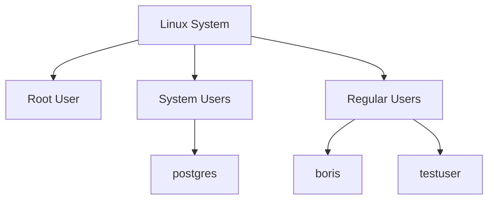

# Linux User Management

## What Are Users in Linux?
Users in Linux are accounts that identify who is using the system and control access to files, processes, and resources. Each user is associated with unique identifiers:

- **UID (User ID):** A number assigned to identify the user.
- **GID (Group ID):** The primary group the user belongs to.
- **Home Directory:** A private space for the user.
- **Shell:** The command-line interface for the user.

### User Structure


## Basic User Management Commands

### Check Existing Users
List all users on the system:

```bash
cat /etc/passwd
```

- Each line represents a user account in the format:
  `username:x:UID:GID:comment:home_directory:shell`

### Create a New User
Create a user with a home directory and prompt for a password:
```bash
sudo adduser testuser
```
- `testuser`: The name of the new user.
- Prompts for a password and creates `/home/testuser`.

### Set or Reset a Password
Assign a new password to a user:
```bash
sudo passwd testuser
```
- Prompts for a new password.
- Updates the password for `testuser`.

### Switch to Another User
Change to a different user account:
```bash
su - testuser
```
- `-`: Loads the new user’s environment (e.g., `.bashrc`).
- Prompts for the user’s password.

### Delete a User
Remove a user account:
```bash
sudo deluser testuser
```
- `--remove-home`: Also deletes the user’s home directory.

### View User Details
Check details for a specific user:
```bash
grep testuser /etc/passwd
```
- Displays the account’s configuration.

### Unlock a Locked User
Ensure a user is not locked:
```bash
sudo passwd -u testuser
```
- Unlocks the account if it was locked.

### File Permissions
View file ownership and permissions:
```bash
ls -l
```
- Example output:
  `-rw-r--r--  1 boris boris 1024 Dec 20  file.txt`
  - Owner: `boris`
  - Group: `boris`

Change file ownership:
```bash
sudo chown testuser file.txt
```
- Assigns ownership to `testuser`.

## Best Practices for User Management
1. Use separate users for different roles (e.g., database administration).
2. Avoid running processes as `root` unless necessary.
3. Regularly audit user accounts to ensure proper permissions.
4. Test configurations or scripts with isolated test users.
